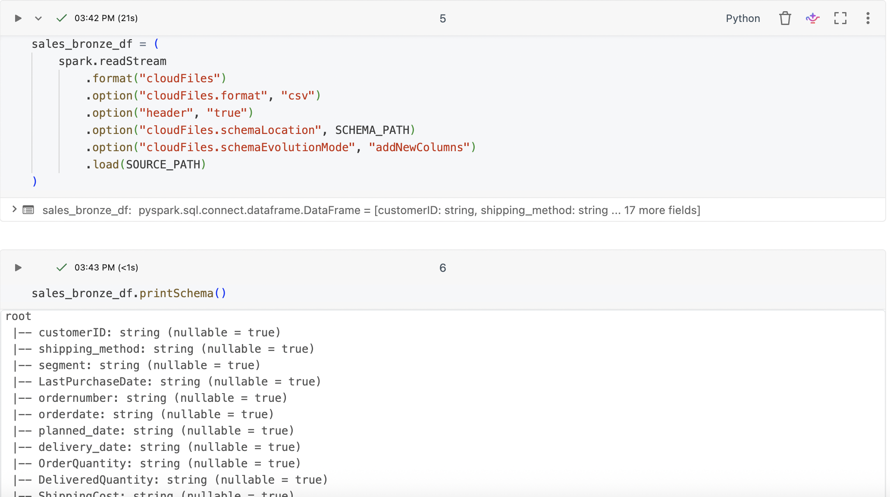
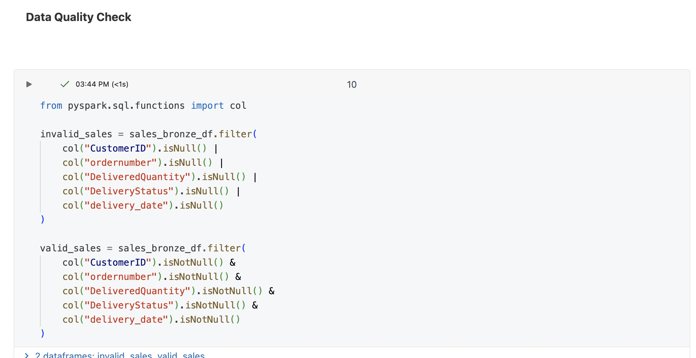
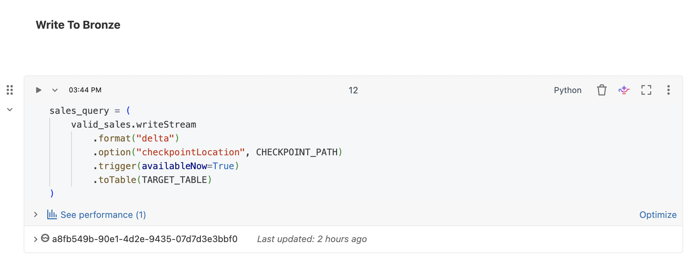
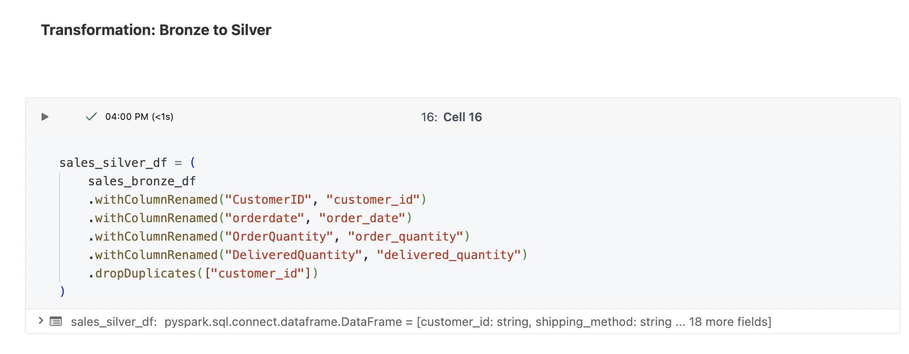
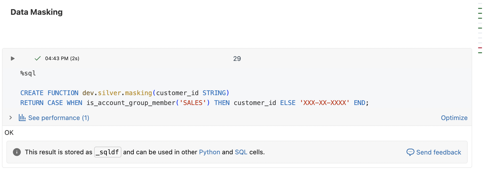

# Azure Databricks Data Platform

An end-to-end data engineering project demonstrating how data is ingested from **Azure Data Lake Storage (ADLS)** into **Azure Databricks**, transformed through a **Bronze → Silver → Gold architecture**, optimized using **Delta Lake**, and governed using **Unity Catalog**.


## 🏗️ Architecture

```text
Azure Data Lake Storage (ADLS)
            │
            ▼
     Databricks Auto Loader
            │
            ▼
       Bronze Layer
            │
            │ Cleansing
            │ Deduplication
            │ Standardization
            ▼
       Silver Layer
            │
            ▼
    Delta Lake Optimization
            │
      ┌─────┼─────┐
      ▼     ▼     ▼
   OPTIMIZE Z-ORDER
   Liquid Clustering
   VACUUM
            │
            ▼
      Unity Catalog
            │
     ┌──────┼──────┐
     ▼      ▼      ▼
  Catalog  Access  Data
  Schema   Control Masking
```

**Data flow:**

**Azure Data Lake Storage → Auto Loader → Bronze → Silver → Optimization → Governance**


## 🛠️ Technologies

* **Azure Data Lake Storage (ADLS)**
* **Azure Databricks**
* **Apache Spark / PySpark**
* **Delta Lake**
* **Auto Loader**
* **Unity Catalog**
* **Databricks SQL**


## 📥 1. Data Ingestion — Auto Loader

Data is ingested from **Azure Data Lake Storage** using **Databricks Auto Loader**.

Auto Loader provides incremental file ingestion and maintains streaming state through a dedicated checkpoint.

**Key concepts demonstrated:**

* Auto Loader
* `readStream`
* `writeStream`
* Delta format
* Schema inference
* Schema evolution
* Checkpoint management
* Data quality validation
* Valid/invalid data routing
* Ingestion metadata

### Screenshot



### Data Quality Check During ingestion

### Screenshot




## 🥉 2. Bronze Layer
Validated incoming data is persisted as a **Bronze Delta table**.

The Bronze layer represents the ingested source data with minimal transformation while preserving useful ingestion metadata.

### Screenshot




## 🥈 3. Bronze → Silver Transformation

The Bronze data is transformed into a cleaner and more standardized Silver dataset.

The transformation includes:

* Column name standardization
* Data cleansing
* Deduplication
* Business-level transformations
* Silver Delta table creation

Example transformation:

```python
sales_silver_df = (
    sales_bronze_df
    .withColumnRenamed("Customer ID", "customer_id")
    .withColumnRenamed("Customer Name", "customer_name")
    .withColumnRenamed("Sale Amount", "sale_amount")
    .dropDuplicates(["customer_id"])
)
```

The ingestion timestamp is maintained from the Bronze layer rather than being unnecessarily recreated during the Silver transformation.

### Screenshot




## ⚡ 4. Delta Lake Optimization

The Silver Delta table is optimized to demonstrate different Delta Lake performance and maintenance techniques.

### OPTIMIZE

Compacts small files into larger files to improve query performance.

```sql
OPTIMIZE dev.silver.sales;
```

### Z-ORDER

Demonstrates data layout optimization for frequently filtered columns.

```sql
OPTIMIZE dev.silver.sales
ZORDER BY (customer_id);
```

### Liquid Clustering

Demonstrates the modern Delta Lake approach to managing data layout dynamically.

```sql
CREATE TABLE dev.silver.sales_liquid
USING DELTA
CLUSTER BY (customer_id)
AS
SELECT *
FROM dev.silver.sales;
```

### VACUUM

Removes obsolete Delta files that are no longer required after the configured retention period.

```sql
VACUUM dev.silver.sales RETAIN 168 HOURS;
```

### Query Performance

Query performance is evaluated using Databricks query execution information, including data scanning and data skipping behavior.


## 🔐 5. Unity Catalog & Governance

**Unity Catalog** is used to demonstrate data governance and access control.

The project uses a structure such as:

```text
dev
├── bronze
│   └── sales
└── silver
    └── sales
```

### Governance concepts demonstrated

* **Catalogs**
* **Schemas**
* **Managed tables**
* **External tables**
* **External locations**
* **Storage credentials**
* **Table permissions**
* **Schema permissions**
* **Column-level masking**

Example permission:

```sql
GRANT USE CATALOG ON CATALOG dev TO `data_engineer`;

GRANT USE SCHEMA ON SCHEMA dev.silver TO `data_engineer`;

GRANT SELECT ON TABLE dev.silver.sales TO `analyst`;
```

Sensitive information can be protected using **column masking**, allowing authorized users to access the original value while other users receive a masked value.

### Screenshot




## 📌 Project Structure

```text
azure-databricks/
│
├── README.md
│
├── ingestion/
│   └── sales_autoloader/
│
├── transformation/
│   └── bronze_to_silver/
│
├── optimization/
│   └── delta_optimization/
│
├── governance/
│   └── unity_catalog/
│
└── images/
    ├── architecture.png
    ├── autoloader.png
    ├── bronze.png
    ├── bronze_to_silver.png
    ├── optimization.png
    └── governance.png
```


## 🎯 Key Engineering Concepts

This project demonstrates practical experience with:

* **Cloud data ingestion**
* **Streaming pipelines**
* **Azure Data Lake Storage**
* **Databricks Auto Loader**
* **Medallion architecture**
* **Delta Lake**
* **Data quality**
* **Deduplication**
* **Incremental processing**
* **Streaming checkpoints**
* **Query optimization**
* **Data governance**
* **Unity Catalog**
* **Data access control**
* **Data masking**


## 🚀 End-to-End Pipeline

The complete pipeline demonstrates the following flow:

```text
Azure Data Lake Storage
          ↓
     Auto Loader
          ↓
   Data Validation
          ↓
     Bronze Delta
          ↓
   Transformation
          ↓
     Silver Delta
          ↓
 Delta Optimization
          ↓
 Unity Catalog Governance
```

This project demonstrates an end-to-end **Azure Databricks data platform**, from cloud ingestion through transformation, optimization, and governance.
